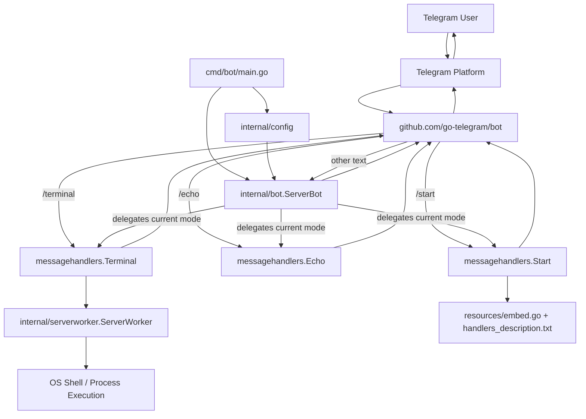
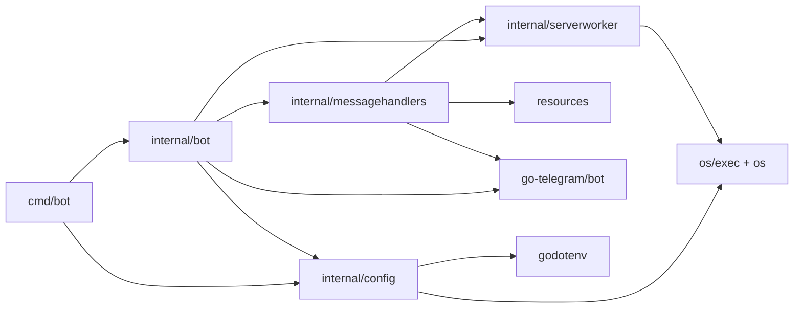
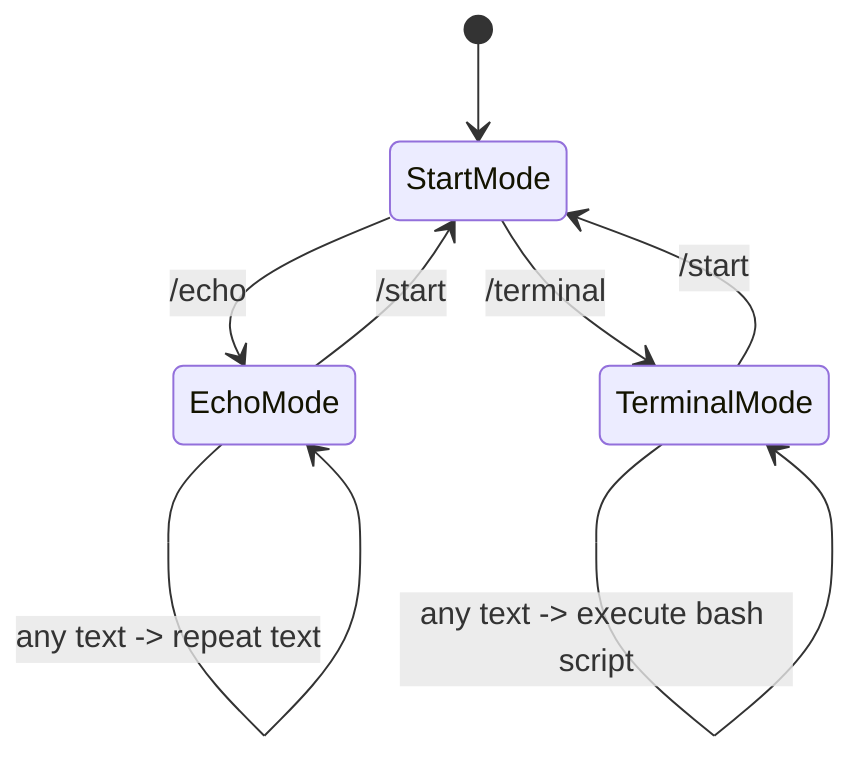

# ServerBot Architecture

## High-Level Flow

## Package-Level View

## Runtime Mode Switching

## Current Responsibilities

- `cmd/bot/main.go`: starts the application, loads config, builds `ServerBot`, starts bot loop with context cancellation.
- `internal/config`: loads `BOT_TOKEN` from environment via `.env`.
- `internal/bot`: composes the application, registers Telegram handlers, stores current message mode.
- `internal/messagehandlers`: mode-specific behavior for `/start`, `/echo`, and `/terminal`.
- `internal/serverworker`: executes terminal input as a temporary bash script and returns output plus prompt text.
- `resources`: embeds static help text shown by `/start`.

## Architectural Notes

- The bot uses a stateful "current handler" model: `ServerBot.messageHandler` determines how non-command text is interpreted.
- That mode is stored once at bot level, not per chat/user, so different chats currently share the same active mode.
- `Terminal` directly calls `ServerWorker.Exec`, which writes the incoming text to a temporary shell script and runs it through `bash`.
- `/c` is registered as an interrupt command, but `interruptHandler` is still empty.
- Tests exist around config loading, handler behavior, and command execution, which helps preserve the current shape of the architecture.
